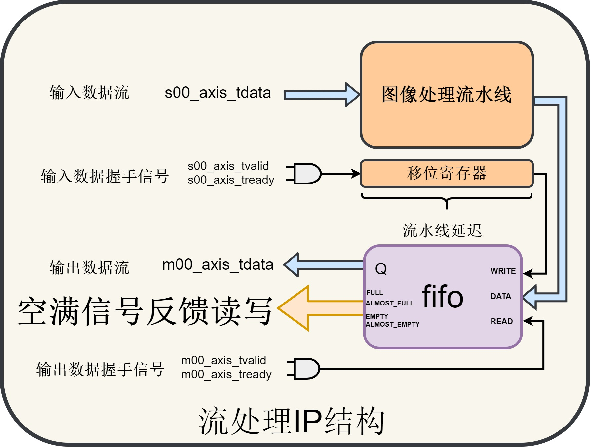

# Image-processing-library-with-RTL
### 一、概述

​	该工程将使用Verilog构建一个开源的图像处理库。

### 二、IP结构

​	图像库主要将图像处理封装为AXI-Stream接口的IP，采用统一的结构。

### 三、验证平台

#### 3.1 单幅图像验证

​	单幅BMP格式的图片由SD卡通过ARM裸机读入，然后写入DDR，再由PL端的DMA读通道读取AXI4形式的数据转换为Stream数据流。随后通过流处理的图像处理IP输出，经由DMA写通道写入DDR，ARM读取数据保存为BMP格式在SD卡中。

#### 3.2 摄像头开发板验证

​	摄像头采集转换为**stream**数据流，经过流处理IP处理后通过DMA写通道写入DDR，同时DMA读通道读出输出到HDMI显示。

### 四、详细介绍

直方图

自适应中值滤波器

直方图均衡

暗度增强

图像缩放